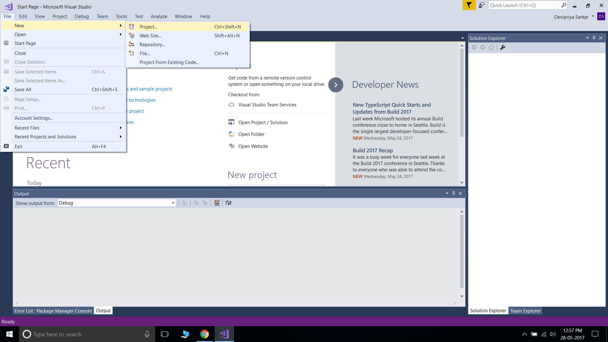
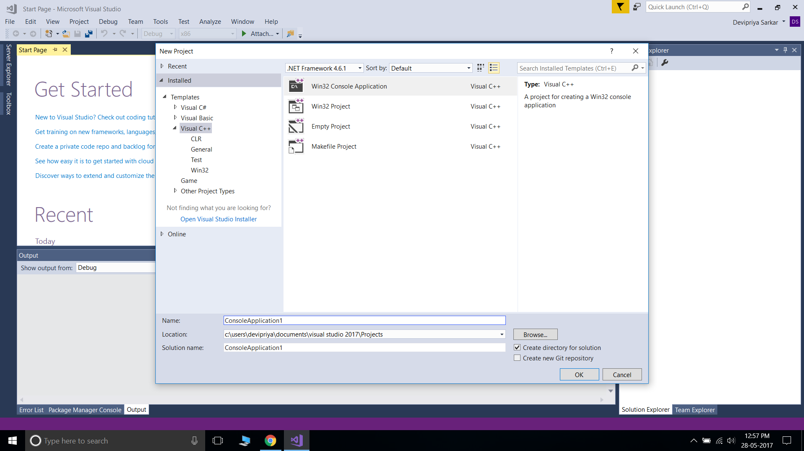
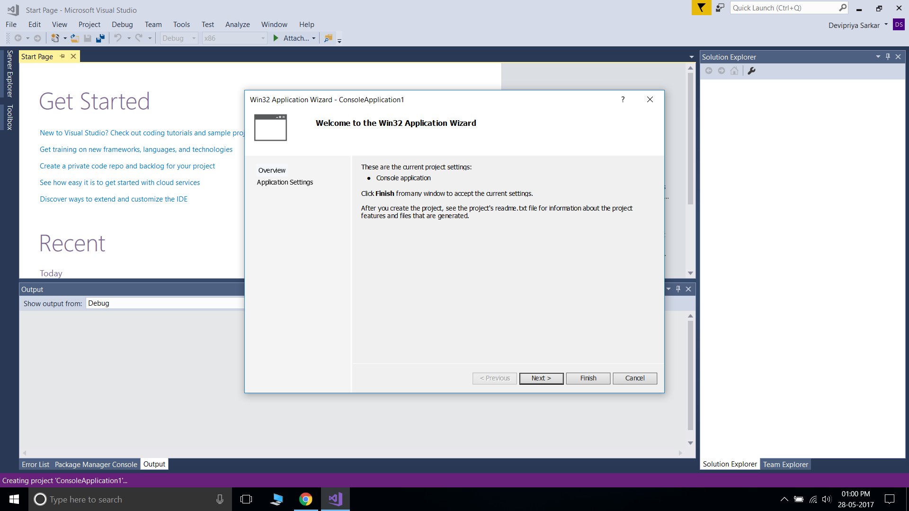
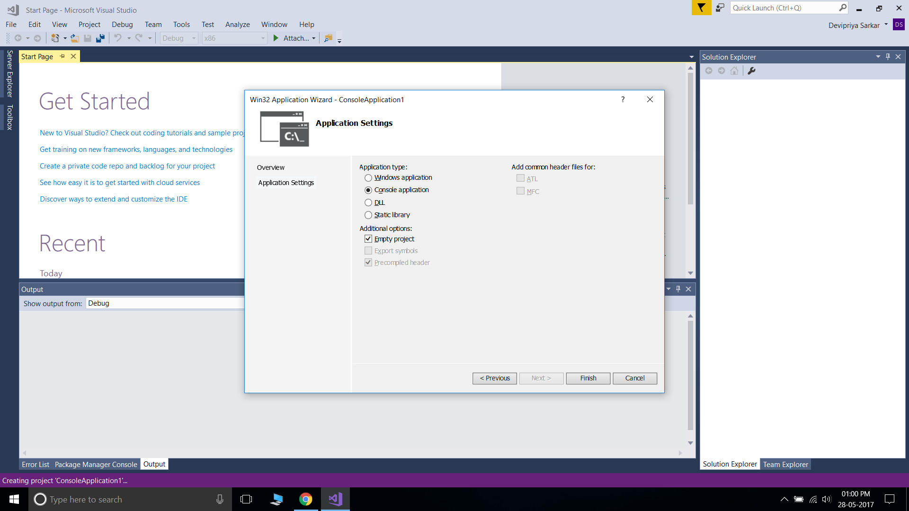
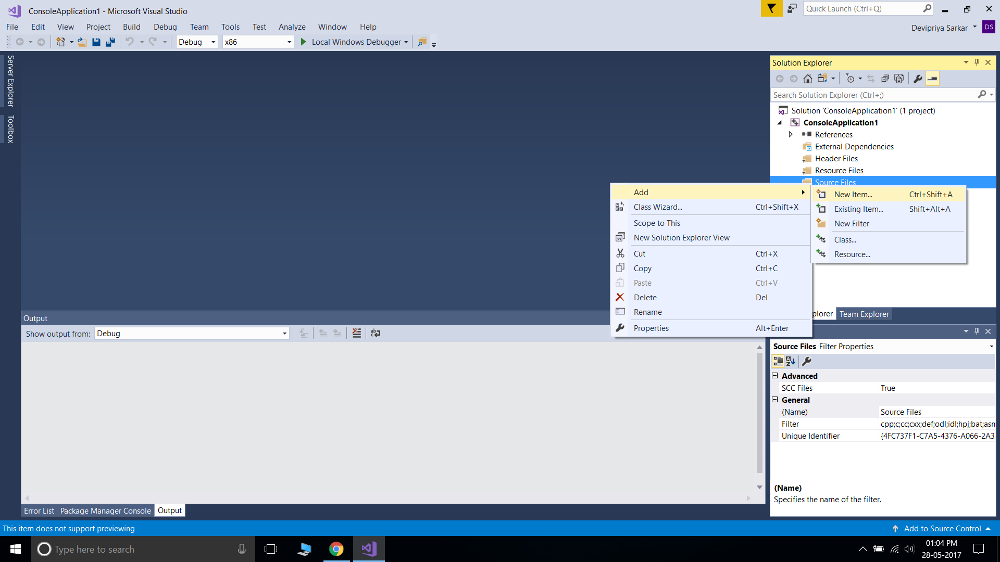
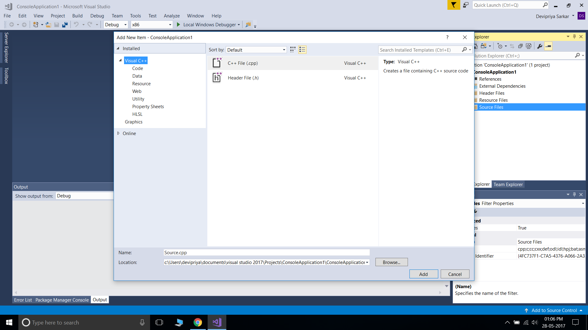
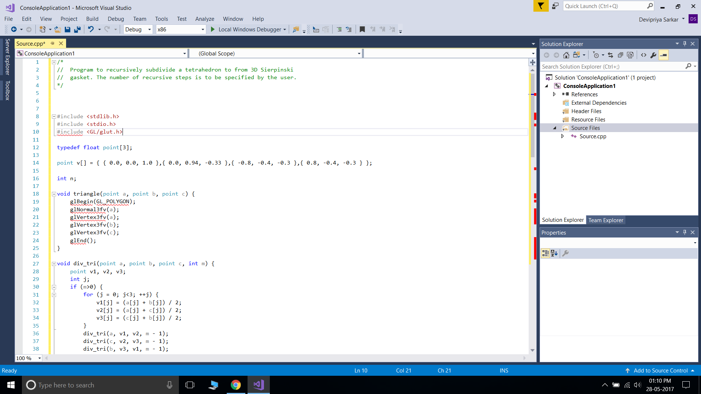
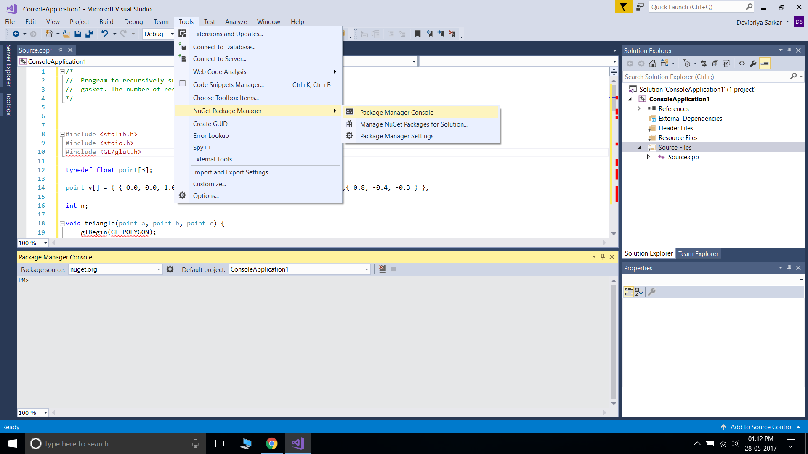
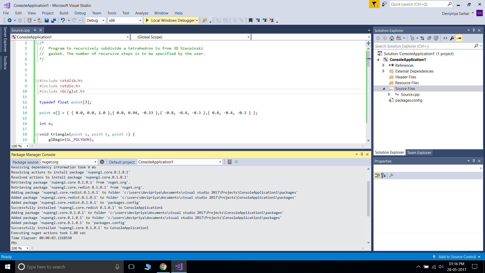

## Computer Graphics and Visualization Lab (VTU 10CSL67)

### PART A
#### Design, develop, and implement the following programs in C / C++ 
1. [Program to recursively subdivide a tetrahedron to from 3D Sierpinski gasket. The number of recursive steps is to  be  specified by the user.](https://raw.githubusercontent.com/Akhilsudh/10CSL67/master/1.c)

2. [Program to implement Liang-Barsky line clipping algorithm.](https://raw.githubusercontent.com/Akhilsudh/10CSL67/master/2.c)  

3. [Program to draw a color cube and spin it using OpenGL transformation matrices.](https://raw.githubusercontent.com/Akhilsudh/10CSL67/master/3.c) 

4. [Program to create a house like figure and rotate it about a given fixed point using OpenGL functions.](https://raw.githubusercontent.com/Akhilsudh/10CSL67/master/4.c)

5. [Program to implement the Cohen-Sutherland line-clipping algorithm.  Make  provision to specify the input line, window for clipping and view port for displaying the clipped image.](https://raw.githubusercontent.com/Akhilsudh/10CSL67/master/5.c)

6. [Program to create a cylinder and a parallelepiped by extruding  a circle and quadrilateral respectively. Allow the user to specify the circle and the quadrilateral.](https://raw.githubusercontent.com/Akhilsudh/10CSL67/master/6.c)  

7. [Program, using OpenGL functions, to draw a simple shaded scene consisting of a tea pot on a table. Define suitably the  position and properties of the light source along with the properties of the surfaces of the solid object used in the scene.](https://raw.githubusercontent.com/Akhilsudh/10CSL67/master/7.c)  

8. [Program to draw a color cube and allow the user to move the camera suitably to experiment with perspective viewing. Use OpenGL functions.](https://raw.githubusercontent.com/Akhilsudh/10CSL67/master/8.c) 

9. [Program to fill any given polygon using scan-line area filling algorithm. (Use appropriate data structures.)](https://raw.githubusercontent.com/Akhilsudh/10CSL67/master/9.c) 

10. [Program to display a set of values {fij} as a rectangular mesh](https://raw.githubusercontent.com/Akhilsudh/10CSL67/master/10.c)

### PART B
Develop a suitable Graphics package to implement the skills learnt in the theory and the exercises indicated in PART A. Use the OpenGL. Click [here](https://github.com/Akhilsudh/MineSweeper-CG-Project) to see our developed package/project.

### Installing prerequisites on Linux
#### On Debian based systems
You can install the required dependencies using the following commands

    sudo apt-get update
    sudo apt-get install freeglut3
    sudo apt-get install freeglut3-dev
    sudo apt-get install binutils-gold
    sudo apt-get install g++ cmake
    sudo apt-get install libglew-dev
    sudo apt-get install g++
    sudo apt-get install mesa-common-dev
    sudo apt-get install build-essential
    sudo apt-get install libglew1.5-dev libglm-dev
    sudo apt-get install libxmu-dev libxi-dev
    
#### On Arch based systems
    pacman -S mesa

### Compiling the code (without CMake)

    g++ file.c -lglut -lGL -lGLEW -lGLU -o compiledFileName
### Executing the  code (without CMake)

    ./compiledFileName
    
### Compiling and running projects using CMake
   Incase you want to use CMake to compile, run and manage your CG projects then use the following commands.
   
   In the CMakeLists.txt file provided in this repo, add the following lines to the end of the file
   
        add_executable(executableName file.c) //Create an executable for the file.
        target_link_libraries(executableName ${OPENGL_LIBRARIES} ${GLUT_LIBRARY} ) // Link the libraries to the executable

   Create a build folder in your present directory
    
        cd ~/10CSL67
        mkdir build
        
   Using CMake precompile the required project
    
        cd ~/10CSL67/build
        cmake ..
      
   In the build directory compile the project
        
        cd ~/10CSL67/build
        make
   
   Now run the program using the executable name given earlier in the build directory
   
        cd ~/10CSL67/build
        ./executableName
   
   
   ## Executing on Windows using Visual Studio 2017   
   1. Open Visual Studio
   
   2. Go to File -> New -> Project    
   
   
   3. In the "New Project" window, select "Visual C++" on the left panel, select "Win32 Console Application" and give the name of your project in the "Name" field below. Press OK.    
   
   
   4. In the "Win32 Application Wizard", 
        * Proceed with the default settings for the first screen ("Overview" Screen)    
        
        * In the "Application Settings" screen, check "Console Application" and "Empty project". Proceed with Finish.    
        
   
   5. In the "Solution Explorer", under your project name, right click on "Source Files". Select Add -> New Item.    
   
   
   6. In the "Add New Item" dialog box, select "Visual C++" on the left panel, select "C++ file" and enter a name for your source file in the "Name" field below. Click on "Add" button.    
   
   
   7. Copy the required C++ source code for your project from this repository and paste it in your source file. Eg.    
   
   
   8. Go to Tools -> NuGet Package Manager -> Package Manager Console    
   
   
   9. In the console that appears below, run ```Install-Package nupengl.core```.    
        Once it is successfully installed, the import error for GL/glut.h should disappear.   
   
   
   10. Run your project with the "Run" button on the toolbar OR Debug -> Start Debugging.
   
   11. Switch to Linux ASAP.
